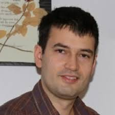
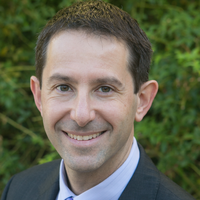
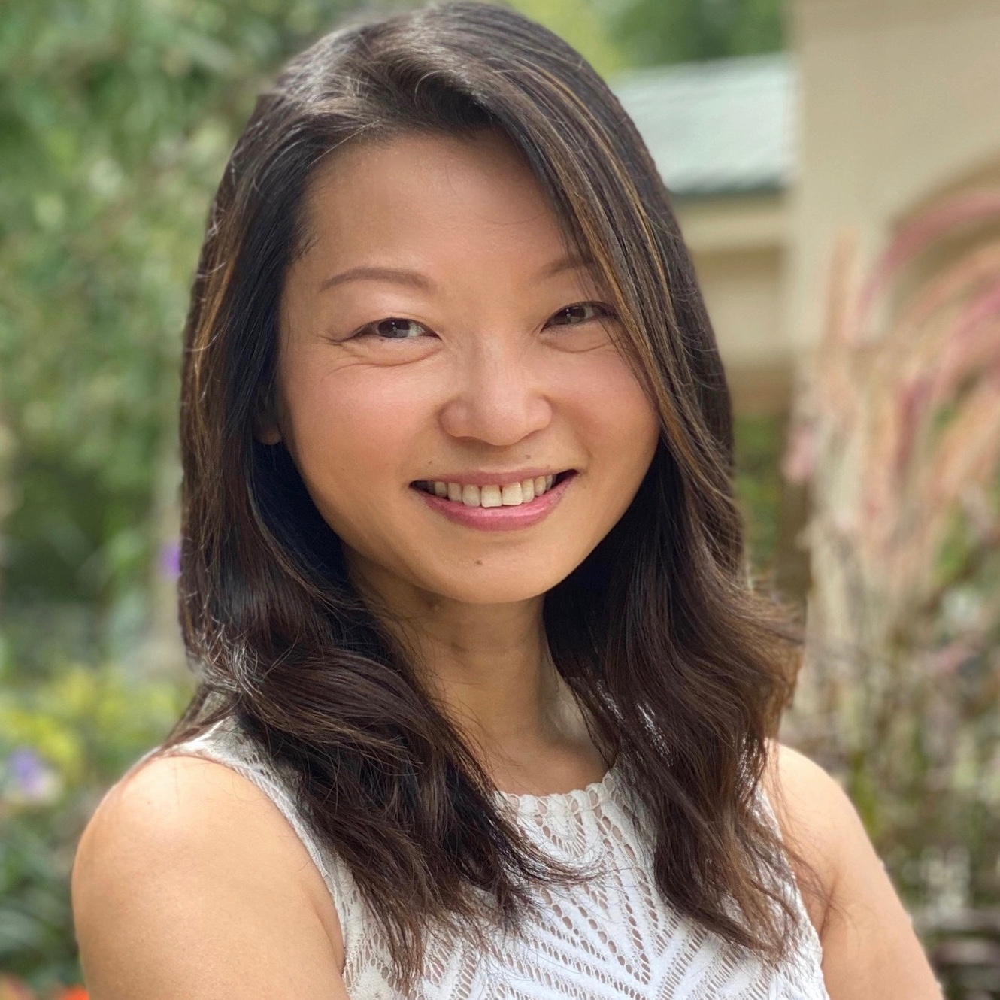

# Tennessee RobUst, Secure, and Trustworthy AI Seminar (TRUST-AI)

---

In the rapidly evolving landscape of artificial intelligence, the imperative for robust, secure, and trustworthy AI systems has never been more critical. The TRUST-AI seminar series aims to address this urgency by bringing to the forefront discussions on ensuring AI technologies advance in capabilities and do so with an unwavering commitment to security, reliability, and ethical governance. Additionally, TRUST-AI serves as a vibrant platform for networking, collaboration, and inspiration, enabling participants to explore innovative solutions to complex problems and contribute to advancing a safer, more equitable digital world. By emphasizing these pillars of AI development, the seminar aims to position UT and Tennessee at the forefront of responsible and impactful AI research and application, ensuring its community plays a pivotal role in steering the conversation toward more secure, inclusive, and trustworthy technological futures.

### Confirmed Speakers

    

        
        
<strong><a href="https://users.umiacs.umd.edu/~tdumitra/" target="_blank" class="speaker-link">Tudor Dumitraș</a></strong> University of Maryland, College Park

    

    

        
        
<strong><a href="https://people.duke.edu/~zg70/" target="_blank" class="speaker-link">Neil Gong</a></strong> Duke University

    

    

        
        
<strong><a href="https://yhongcs.github.io/" target="_blank" class="speaker-link">Yuan Hong</a></strong> University of Connecticut

    

    

        
        
<strong><a href="https://www.cs.utexas.edu/~pstone/bio_long.shtml" target="_blank" class="speaker-link">Peter Stone</a></strong> The University of Texas at Austin

    

    

        
        
<strong><a href="https://www.ytian.info/" target="_blank" class="speaker-link">Yuan Tian</a></strong> University of California, Los Angeles

    

    

        
        
<strong><a href="https://www.cs.emory.edu/~lxiong/" target="_blank" class="speaker-link">Li Xiong</a></strong> Emory University

    

    

        
        
<strong><a href="https://mi-zhang.github.io/" target="_blank" class="speaker-link">Mi Zhang</a></strong> The Ohio State University

    

    

    
    

### Organizing Committee

- [Jian Liu (Chair)](https://web.eecs.utk.edu/~jliu/)
- [Doowon Kim](https://doowon.github.io/)
- [Weizi Li](https://weizi-li.github.io/)
- [Gregory Peterson](https://web.eecs.utk.edu/~gdp/)
- [Hairong Qi](https://aicip.github.io/)
- [Hector Santos-Villalobos](https://www.eecs.utk.edu/people/hector-santos-villalobos/)
- [Catherine Schuman](https://catherineschuman.com/)
- [Amir Sadovnik (Joint Faculty with ORNL)](https://www.ornl.gov/staff-profile/amir-sadovnik)
- [Michela Taufer](https://globalcomputing.group/)

### Sponsor

This seminar series is a part of the AI TENNessee Distinguished Seminar Series, proudly sponsored by the [AI Tennessee Initiative](https://research.utk.edu/oried/research-innovation-initiatives/ai-tennessee-initiative/).

### Contact

For more information about the seminar please follow us at:

    
    
    

